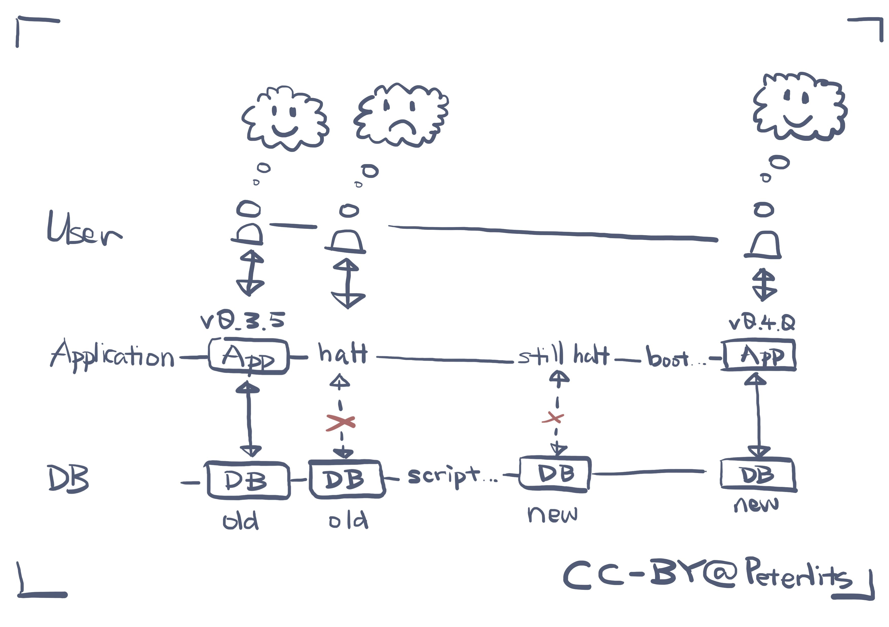
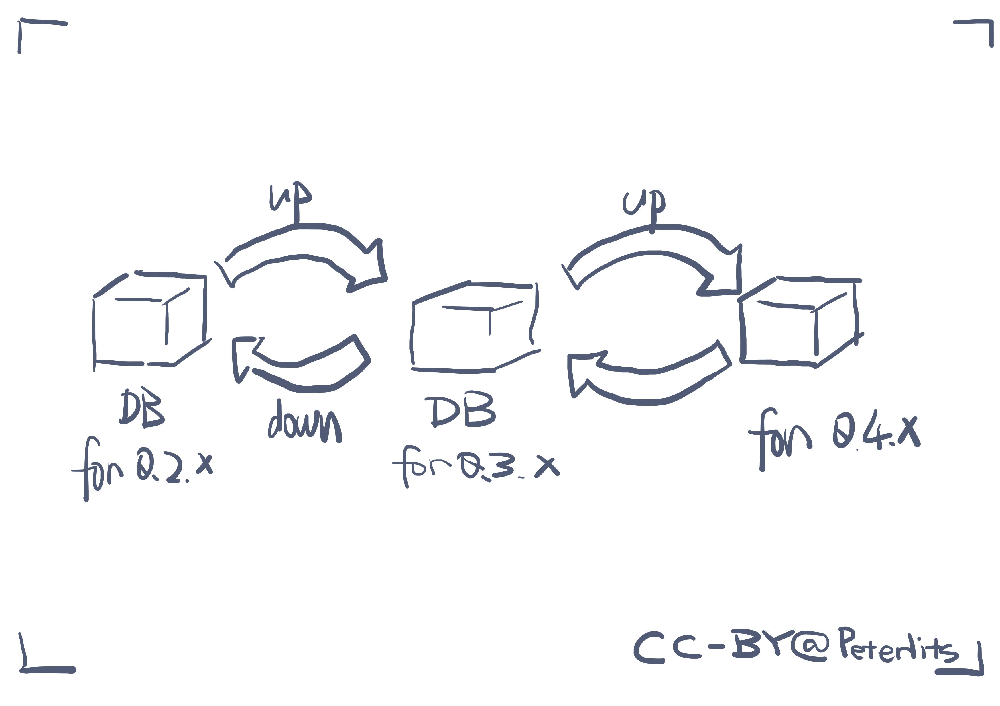
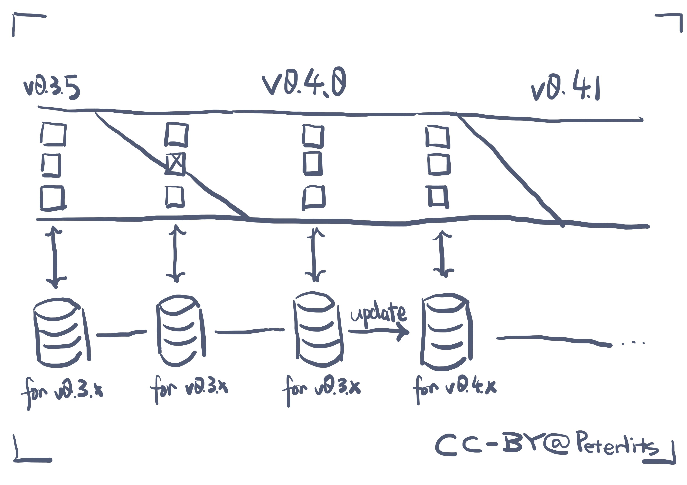

> 本文部分信息来源于其他地方。见 [链接和引用](#链接和引用) 了解更多。

> 在软件工程中，唯一不变的就是变化。

任何非平凡的、需要数据库的应用都需要随着时间发展而更改数据库模式（database schema）、以支持新功能。

是的，这不是很频繁，但是我们有时候的确会需要它。

## 分类

应用属性的不同，也会影响到我们应该如何迁移模式：

- 应用允许一定的停机（允许低可用性）。
- 应用必须在迁移过程中保证高可用性。

在 [低可用性，单服务单实例的模式迁移](#低可用性单服务单实例的模式迁移) 中，我们会讨论最简单的情况，那就是一个数据源对应一个服务，同时服务只包含一个实例。

这是最简单的情况，它对应的缺点也很明显：同一时间只有一个实例运行，这表明了服务升级的同时，服务本身就对外不可用了。我们可以选择最简单的情况：实例启动的时候，我们先更新数据库模式。

但是它的缺点也是不可忽视的，那就是存在服务不可用的时间。这在微服务架构下可能是不可忍受的（对于下游服务而言它会依赖上游服务，如果上游服务中某一个服务不可用，那么就会导致该服务不可用）。

在小型项目，部分开源项目中这是可以接受的。

我们知道，对于单服务单实例而言它本身就不可能是高可用的：对于服务升级而言，单个实例在短暂的时间内是停止服务的，所以它天生不支持高可用。

所以接下来我们会讨论 [高可用性，单服务多实例的模式迁移](#高可用性单服务多实例的模式迁移)，来讨论多个实例如何平滑迁移数据库模式。

## 低可用性，单服务单实例的模式迁移

在一个小型的、或者用户量不大的应用中，低可用性是可以接受的，我们可以直接在命令行中进行迁移，但是在更大的系统中，我们可能需要借助 migrate 工具或者库。不管怎么样，管理员的执行过程如下：

- 先让应用（`v0.3.5`）停机。
- 运行测试好的脚本，从而升级数据库的模式。
- 运行新版本的应用（`v0.4.0`）。

比如下图所示：



不同的是，如果我们使用一些脚本来迁移的话，会略显麻烦一些，而且操作的时间也会更长一些，也更需要人工去介入，从而导致出错的可能更大。但是脚本这个模式非常容易理解，在运行规模比较小的情况下，这是能接受的。甚至我们也可以接受将迁移脚本写在应用程序中，从而让应用程序在启动的时候，运行名为 `InitDB` 的函数（或者类似的名字）：

```go
// 示例函数：在运行 Application 的时候迁移数据库。
func InitDB(db *DB) error {
    if users := db.Run("SELECT * FROM users"); len(users) == 0 {
        db.Run("INSERT INTO users VALUE (?, ?)", "admin", hashedPassword("admin"))
    }

    return nil
}
```

这是可以接受的，而且非常简单直观，但是软件的编写者必须要明白它带来的一些缺点：

- 这个函数在每次运行时都会运行，编写者必须确保这个函数多次运行也不会出问题。
- 这个函数中我们缺乏鉴定 DB 版本的工具，也就是说我们无法了解到 DB 的版本。这里我们可以选择使用一些 `if-else` 语句块来通过一种比较 hack 的方式来升级数据库（如果它不满足...... 那么它需要通过 ...... 来升级）。如果这种语句过多的话，可读性不会很好的。

总之在规模更大一些的情况下，或者管理员已经熟悉 migrate 工具的情况下，管理员可能会主动求助于 migrate 工具，从而：

- 有一个 CLI 工具来管理这些 migrate 脚本。
- 版本化数据库（比如说我们启动 `v0.4.0` 的 Application 的时候，migrate 工具能够轻而易举地发现 DB 的版本落后了，并自动运行 migrate 脚本）。
- 支持快速的回退。
- 自动运行（当发现 Application 的版本和 DB 版本不匹配的时候能自动运行脚本）。

这些迁移脚本可能仅仅是一些 SQL 语句的代码片段，它们可以用于升级数据库的 schema。

一般来说，我们有一些工具来创建和运行这些 migrate 脚本。而这些工具一般都被包含在 ORM 框架中、或者有一些独立的 migrate 库。比如说：

- 在 Python 的 Web 框架 Django 中，它不仅提供了全面的 HTTP 框架，还提供了 ORM 框架，在 ORM 框架下面还有 migrate 迁移工具。
- 在 Golang 的 gORM 框架中，它也提供了自动迁移，见：[gORM - 自动迁移](https://gorm.io/zh_CN/docs/migration.html)（但是个人感觉不太行，很明显 gORM 中没有将重心放在迁移上）。
- 也有一些 migrate 迁移工具，比如 [golang-migrate](https://github.com/golang-migrate/migrate)。和名字不同，它可以作为一个语言无关的 migrate 工具。

在大多数数据库迁移工具中，我们一般会在项目目录结构中存在一个文件夹，专门用以实现模式迁移。它存放着多个模式迁移相关的文件。模式迁移被人为地划分为多个版本（我们称为 “模式迁移版本“，在某些上下文下被缩略为“迁移“一词），而每一个版本一般对应两个文件：up 文件和 down 文件：前者表示应用这个版本的模式迁移，后者表示卸载这个模式迁移。

如下图所示：



比如出于业务需要，我们需要新建一个表结构，那么我们可以使用工具来创建两个 SQL 文件：

```sql
-- 000001-add-table-foos.up.sql
CREATE TABLE foos (
    id INT PRIMARY KEY AUTOINCREMENT,
    name VARCHAR(128)
);
```

```sql
-- 000001-add-table-foos.down.sql
DROP TABLE foos;
```

在数据库内我们有一个特殊的表，用来维护数据库内部的特殊模式元信息。这里它记录着数据库的模式版本为 `000000`，在我们使用工具或者库，可以将其升级为 `000001` 版本，现在我们就可以得到新的表 `foos` 了！

我们会将模式迁移文件和代码放在一起进行版本管理，并且令其在运行前自动进行模式迁移（通过脚本或者调用库！非常简单啦），比如说一个简单的 Node.js 服务，它的 `application.json` 可能如下：

```json
{
  "scripts": {
    "start": "./run-migrations && node app.js"
  }
}
```

## 高可用性，单服务多实例的模式迁移

在云原生基础上开发的工程师而言，这是最常见的情况，就是一个数据源仅仅对应一个服务，同时它服务运行着多个实例。

这就导致了同一时间，在短暂的升级间隙中我们会同时存在两个不同版本的实例。

如果我们思考一下，我们就会知道所有的模式迁移都可以拆解为以下两种情形：

- 增加字段。这个时候新版本能够妥善处理，而老版本也能 hold 住。
- 删除字段。这个时候新版本自然也能妥善处理，而老版本就会开始报错了（老版本会抱怨找不到它需要的字段）。

数据库的模式从旧版本迁移至新版本，归根结底就可以分为两个阶段：

- 先删除新版本不再需要的字段；
- 再增加新版本开始需要的字段。

总之无论如何，一旦新版本开始删除某一个字段的时候，对于老版本来说是不可接受的。这导致仅仅是修改字段的命名错误也变得非常麻烦。但是这并不代表没有解决办法：

- 首先在新版本和旧版本之间定义一个过渡版本。
- 过渡版本既能够读取新模式下的数据库，又能够读取旧模式下的数据库。
- 我们先将旧版本迁移到过渡版本，之后再模式迁移，再然后迁移到新版本。

比如说有如下的示意图：



可以看到，开发流程分为了以下几步：

- 根据业务需求，我们需要更改数据模式，这个一个破坏性变更，所以我们决定开发一个新版本，这里是 `v0.4.x`。
- 经过一段时间的努力，`v0.4.0` 终于开发出来了，它既能够处理旧数据，同时也能处理未来的新数据。我们开始上线。在图中我们看见上线过程中，某一个时刻，三个实例中有一个是不可用的，有一个是运行中的 `v0.4.0` 实例，还有一个是 `v0.3.5` 实例。它们都和旧模式的数据库交互。
- 在完全升级之后，升级数据库模式也提上了日程，我们通过一定的操作（具体见下文），将数据库的模式升级了，可以看见 `v0.4.0` 的服务依然在迁移过程中保证高可用。
- 在 `v0.4.1` 中，我们删除了为了兼容旧模式数据库而保留的代码，避免了技术负债。

问题在于，我们如何升级数据库呢？在现实世界中我们有以下方案：

- 业务双写：我们可以同时存在两个数据库（当然同时存在两个表也是可行的），`v0.4.0` 的服务同时将数据写入到旧的数据库和新的数据库，我们甚至还有一些辅助脚本帮助我们同步两个数据库的数据，在两个数据库同步地差不多了，让 `v0.4.0` 只读写新数据库，在观察一段时间之后我们删除旧数据库，数据库这个时候升级完成。
- 对于一些 NoSQL 数据库而言，比如说 MongoDB，我们可以将一个 schema 的 flag（比如说 `schema_version`）放在数据中。然后缓慢地根据这个 flag 更新整个数据库。

但是有更好的解决方案吗？没有那么多的麻烦，更容易回滚，更加自动化一些吗？我们依然可以借助 migrate 工具 [3]。

如我们在 [低可用性，单服务单实例的模式迁移](#低可用性单服务单实例的模式迁移) 中谈及的 migrate 工具，在多实例中我们也可以借助它来完成更轻松简单的零停机部署，如同我们提及的，所有的迁移都可以分为两步走，分别是字段的增加和字段的移除，我们：

- 在 `v0.3.5` 到 `v0.4.0` 的时候，增加对应字段，并且在 `v0.4.0` 中，我们存在代码用来维护它的一致性。
- 在 `v0.4.0` 到 `v0.4.1` 的时候，我们删除对应字段，并移除为了兼容而导致的技术负债代码。

将数据库变更融合进部署过程中，可以降低我们的心智负担。

<!--
## 高可用性，多服务多实例的模式迁移

这是最糟糕的情况。我们应该避免一个数据源对应多个服务。因为单服务多实例的迁移已经搞得非常麻烦了，多服务就会更加糟糕。

但是这并不是不可能存在的事情，比如说我们打算重写一个服务，在重写的过程中，我们的生产环境依然大部分走的是老服务的流量。这个时候我们应该怎么做呢？

- 选定模式迁移的模式子集，并进行指标监控。
- 在监控过程中，我们需要为新版本编写一个过渡版本，它需要能够处理新的数据库模式和旧的数据库模式。
- 监控以使得模式子集的服务流量从老服务逐渐迁移至新服务的过渡版本。
- **（一定要慎重！指标需要反复确认保证没有流量）** 关闭老服务的模式子集对应的服务接口，以避免影响后续流程。
- 让新服务的过渡版本迁移到新服务的新版本上去。
-->

<!--
## 语言支持

### Go 支持
对于 Go 而言，我们可以使用库 [golang-migrate](https://github.com/golang-migrate/migrate)（这个 star 数有点多哦），比如我们可以通过 CLI 工具创建一个迁移。

```shell
migrate create -ext sql -dir db/migration -seq init_schema
```

它就生出了对应的迁移文件。

golang-migrate 在其源代码中实现了对 [[MongoDB]] 的支持（见文件 [mongodb.go](https://github.com/golang-migrate/migrate/blob/master/database/mongodb/mongodb.go)），我们可以分析一下它。

首先是版本部分。在实现中，我们在 MongoDB 中存储了一个特殊的、专门用以模式迁移的 collection，其中有且仅有一个文档，那就是当前模式的版本。通过这个 collection，我们实现了两个接口方法，分别是：

```go
func SetVersion(version int, dirty bool) error
func Version() (version int, dirty bool, err error)
```

我们还需要使用锁的概念来保证互斥（为什么我们不能直接用上面的 version collection 呢？）

好吧，有点难搞，于是放弃思考，我是一个不会思考的笨猫猫，TODO...

### Rust 支持
可以看看 [[diesel]] 这个 ORM。
-->

## 链接和引用

1. Alberto - 如何迁移数据库架构: https://dev.to/bnevilleoneill/how-to-migrate-a-database-schema-at-scale-1ml9
2. TechSchool - 如何使用 Golang 编写模式迁移: https://dev.to/techschoolguru/how-to-write-run-database-migration-in-golang-5h6g
3. Spring Blog - 带有数据库的零停机部署: https://spring.io/blog/2016/05/31/zero-downtime-deployment-with-a-database

想要评论？请直接联系我：peterlitszo@gmail.com。
